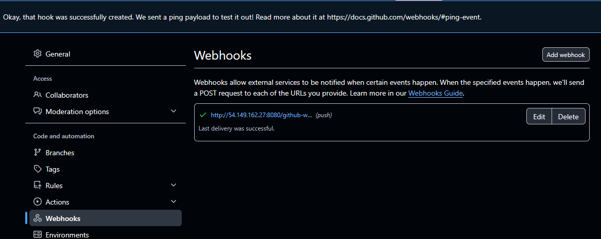
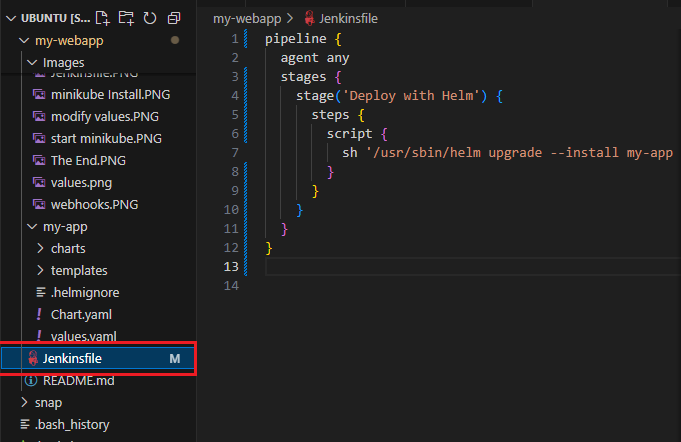
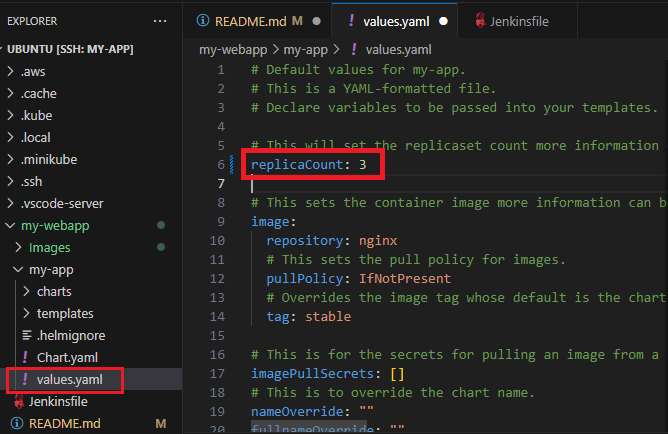

# Deploying a Web Application using Helm in Kubernetes

## Why Helm charts are needed
- Helm charts are packages or collections of kubernetes resources.
- They simplify the deployment and management of applications in Kubernetes by binding all neccessary resources into a single manageable unit.
- Helm charts promote reusability and consistency, allowing you to define, install and upgrade even the most complex Kubernetes application easily.
- Helm installs the whole dependency tree of a project if you run the install command for the top-level chart. You just a single command to install your entire application, instead of listing the files to install via kubectl.

## Overview
We will deploy a simple web application in a kubernetes cluster using Helm. This demo covers using Helm charts, customizing `deployments` with `templates` and `values`, installing and running Helm, and integrating Helm into a CI/CD pipeline.

## Steps
1. Install Helm as well as other tools and packages.
2. Create a new Helm chart
3. Customize the Helm chart
4. Deploying the Application
5. Integrating Helm with CI/CD (Jenkins)
6. Update Helm chart and trigger Jenkins pipeline.


## Step 1: Install Helm
From Apt (Debian/Ubuntu)

```
curl https://baltocdn.com/helm/signing.asc | gpg --dearmor | sudo tee /usr/share/keyrings/helm.gpg > /dev/null
sudo apt-get install apt-transport-https --yes
echo "deb [arch=$(dpkg --print-architecture) signed-by=/usr/share/keyrings/helm.gpg] https://baltocdn.com/helm/stable/debian/ all main" | sudo tee /etc/apt/sources.list.d/helm-stable-debian.list
sudo apt-get update
sudo apt-get install helm
```


### - Install minikube to run the kubernetes cluster for the demo

```
curl -LO https://github.com/kubernetes/minikube/releases/latest/download/minikube-linux-amd64
sudo install minikube-linux-amd64 /usr/local/bin/minikube && rm minikube-linux-amd64
```


#### Start minikube 
`minikube start --driver=docker`


#### Install kubectl

`sudo snap install kubectl --classic`


### - Install Docker to drive minikube

```
# Add Docker's official GPG key:
sudo apt-get update
sudo apt-get install ca-certificates curl
sudo install -m 0755 -d /etc/apt/keyrings
sudo curl -fsSL https://download.docker.com/linux/ubuntu/gpg -o /etc/apt/keyrings/docker.asc
sudo chmod a+r /etc/apt/keyrings/docker.asc

# Add the repository to Apt sources:
echo \
  "deb [arch=$(dpkg --print-architecture) signed-by=/etc/apt/keyrings/docker.asc] https://download.docker.com/linux/ubuntu \
  $(. /etc/os-release && echo "${UBUNTU_CODENAME:-$VERSION_CODENAME}") stable" | \
  sudo tee /etc/apt/sources.list.d/docker.list > /dev/null
sudo apt-get update
```

```
sudo apt-get install docker-ce docker-ce-cli containerd.io docker-buildx-plugin docker-compose-plugin
```


### - Install and configure AWS cli for access and permission

`sudo snap install aws-cli --classic`


`aws configure`


## Step 2: Create a new Helm chart

- Create and cd into a new directory `my-webapp`
- Create a new Helm chart `my-app`

  `helm create my-app`
  
  

- Initial git and push into remote git repository


## Step 3: Customize the Helm chart

It's pretty easy to create a chart in Helm. First, you need to have Helm installed. Then, just type in helm create <chart name> and it will create a directory filled with files and other directories. Those files are required for Helm to create a chart.

Let's take a closer look at what this file tree looks like and what the files are within it:

- **chart.yaml:** This is where you'll put the information related to your chart. That includes the chart version, name, and description so you can find it if you publish it on an open repository. Also in this file you'll be able to set external dependencies using the dependencies key.

- **values.yaml:** Like we saw before, this is the file that contains defaults for variables.

- **templates (dir):** This is the place where you'll put all your manifest files. Everything in here will be passed on and created in Kubernetes.

- **charts:** If your chart depends on another chart you own, or if you don't want to rely on Helm's default library (the default registry where Helm pull charts from), you can bring this same structure inside this directory. Chart dependencies are installed from the bottom to the top, which means if chart A depends on chart B, and B depends on C, the installation order will be C ->B ->A.

There are other fields, but these are the most common, and they're the required ones.

**A quick note:** When installing Helm, make sure you're installing version 3. Version 2 still works, but it needs a server-side component called Tiller, which ties your helm installation to a single cluster. Helm 3 removed this need with the addition of several CRDs, but it's not supported in all Kubernetes versions.

1. Modify `values.yaml` using a text editor.

```
replicaCount: 2

image:
  repository: nginx
  tag: stable
  pullPolicy: IfNotPresent
```


- This configuration will deploy 2 replicas (`replicaCount: 2`) of the nginx server.

- Save your changes


2. Customize `templates/deployment.yaml`:

- Open the `deployment.yaml` file in the `templates/` directory.

- Remove the line below from under `spec.template.spec.containers.resources`.

\{\{- toYaml .Values.resources | nindent 12 \}\}

-Add a simple resource request and limit under `spec.template.spec.containers.resources`.
 This helps Kubernetes to mange resources efficiently. 

```
 resources:
  requests:
    memory: "128Mi"
    cpu: "100m"
  limits:
    memory: "256Mi"
    cpu: "200m"
```


- The above settings specify that your deployment should request 128Mi of memory and 100m of CPU but it won't use more that 256Mi of memory and 200m of CPU. 

- Save the file after making your changes. 

3. Commit and push changes 

```
git add .
git commit -m "Customized Helm chart"
git push
```


## Step 4: Deploying your Application

**1. Deploy with Helm**: Navigate to the root of your project directory `my-webapp`.
Deploy the application on Kubernetes using the command below:

`helm install my-app ./app`


**2. Check Deployment**:
kubectl get deployments


**3. Visit Application URL**: Get the application Url by running the below commands:

```
export POD_NAME=$(kubectl get pods --namespace default -l "app.kubernetes.io/name=webapp,app.kubernetes.io/instance=my-webapp" -o jsonpath="\{.items[0].metadata.name\}")

export CONTAINER_PORT=$(kubectl get pod --namespace default $POD_NAME -o jsonpath="\{.spec.containers[0].ports[0].containerPort\}")

kubectl --namespace default port-forward $POD_NAME 8081:$CONTAINER_PORT
```
Visit http://127.0.0.1:8080

## Step 5: Integrating Helm with CI/CD (Jenkins)

### A. Integrate Helm with Jenkins

**1. Jenkins setup:**

Install Jenkins on your system with the default recommended plugins.


**2. Determine Helm Binary Path:**

The full binary path of Helm is required in the Jenkins pipeline script.

To find it, use 

- Linux/macOS: `which helm`
- Windows: `Get-command helm | select-object -ExpandProperty Source` in powershell.


**3. Create a Jenkins Pipeline:**

- In Jenkins, create a new pipeline job.
- Set the pipeline source as the git repository you pushed your code to.
- Configure the pipeline to trigger on build on commit to your repository.


*Jenkins configuration* 


*Webhooks configuration on Github*

**4. Pipeline Script example with full Helm path:**

- Use the determned full path of Helm in the in the pipeline script. For example:

```
pipeline {
  agent any
  stages {
    stage('Deploy with Helm') {
      steps {
        script {
          sh '/usr/sbin/helm upgrade --install my-app ./app --namespace default'
        }
      }
    }
  }
}
```
Replace `/usr/local/bin/helm` with the path determined in step 2.



### B. Update Helm chart and trigger Jenkins pipeline.

**1. Update Helm chart and push changes:**

- Edit the `values.yaml` file
  - Open  values.yaml  in your `my-app` chart directory.
  - Change the `replicaCount` to 3 to increase the number of replicas.
  - Save the changes.

  

- Edit the `templates/deployment.yaml` file:
  - Open `deployment.yaml` file located in the `templates` directory. 
  - Locate the `resources` section under `spec.template.spec.containers`.
  - Update the resource request as follows:

  ```
  resources:
  requests:
    memory: "180Mi"
    cpu: "120m"
  ```
- Save the file after making your changes.


**2. Commit and push changes:**

- Use git commands to commit your changes and push them to the remote repository. This will trigger the Jenkins pipeline.

- Execute the following commands in your terminal
```
git add .
git commit -m "Updated replicas, memory and CPU requests"
git push
```

**3. Jenkins Pipeline Trigger:**
- Once you push ypur changes to the repository, the configured Jenkins pipeline will detect the commit.
- Jenkins will then automatically start a new build, deploying your updated Helm chart with the new configuration,


